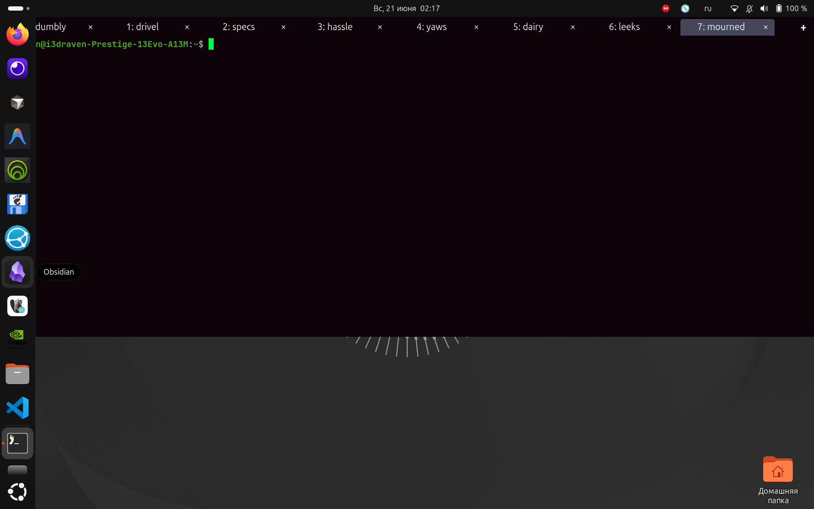

# Quake Style App

A Quake-style dropdown launcher for GNOME Shell on Wayland. Press a hotkey and a
window - [foot](https://codeberg.org/dnkl/foot) by default, but any application -
drops down from the edge of the screen. Press the same key again, or click away,
and it hides. The process keeps running, so your session survives between presses.

On Wayland only the compositor (GNOME Shell) may position windows, so the work is
done by a small GNOME Shell extension that registers a global hotkey for you.



## Features

- Any application, not only foot - set the launch command and the window
  app-id/class to match. foot is just the default.
- Toggle: the same key shows and hides; drops from the top or bottom at a
  configurable width and height fraction.
- Auto-hide on focus loss (hidden, never closed, so the session lives), and the
  tab bar comes back when you re-focus the window from Alt+Tab.
- Native tab bar backed by tmux - a real tab strip drawn over the window: click to
  switch, "+" to add, per-tab "x" to close, right-click for a menu (close, close
  others, close to the left/right), scroll arrows + mouse wheel on overflow,
  auto-scroll to the active tab. tmux runs on a private socket, fully isolated from
  your own tmux.
- Internal keyboard shortcuts - configured in the extension's Preferences, bound by
  the compositor. No D-Bus, no external commands, no system shortcuts touched.
- Configurable window icon - shown in Alt+Tab / the dock. Defaults to the launched
  app's own icon, or pick any system icon from a visual grid in Preferences.
- Full GNOME preferences UI - every option is a GSetting.
- Dracula-themed tab bar (colors configurable); the terminal and your shell prompt
  are left untouched.

## Requirements

- GNOME Shell 47-50 on Wayland (the default on modern Ubuntu/Fedora).
  Check with `echo $XDG_SESSION_TYPE` -> `wayland`.
- The `foot` terminal (the default app) and `tmux` (for the tab bar).

```bash
sudo apt install foot tmux        # Debian / Ubuntu
# sudo dnf install foot tmux      # Fedora
```

Both are optional if you launch a different app and don't use tabs.

## Install

The extension is built into a standard bundle with `gnome-extensions pack` and
installed with `gnome-extensions install` - the same flow as an upload to
extensions.gnome.org. Step by step:

```bash
# 1. Get the source
git clone https://github.com/3DRaven/quake-style-app.git
cd quake-style-app

# 2. Optional dependencies (foot is the default app, tmux backs the tab bar)
sudo apt install foot tmux        # Debian / Ubuntu
# sudo dnf install foot tmux      # Fedora

# 3. Compile the settings schema, then pack the bundle.
#    logic.js and tmux.conf aren't "standard" extension files, so they must be
#    listed explicitly; the schemas/ dir is picked up automatically.
glib-compile-schemas schemas/
gnome-extensions pack --force \
  --extra-source=logic.js \
  --extra-source=tmux.conf \
  --out-dir=dist .

# 4. Install the bundle (this also compiles the schema into place)
gnome-extensions install --force \
  dist/quake-style-app@i3draven.github.io.shell-extension.zip
```

Then **log out and back in** - on Wayland a new extension is only loaded at login.
After re-login, enable it (and check its state):

```bash
gnome-extensions enable quake-style-app@i3draven.github.io
gnome-extensions info   quake-style-app@i3draven.github.io
```

To update later, re-run steps 3-4 and log out/in again.

> Requires GNOME Shell 47-50. Earlier versions lack APIs this extension relies on
> (`St.ScrollView.set_child`, `Adw.Dialog`).

## Set a hotkey

Open Preferences and assign keys under "Keyboard shortcuts":

```bash
gnome-extensions prefs quake-style-app@i3draven.github.io
```

Toggle defaults to `Ctrl+F10`; New tab / Close tab / Next / Previous start unbound.
The shortcuts are the extension's own (registered with the compositor), so nothing
in GNOME Settings -> Keyboard is touched.

## Settings

Everything is a GSetting, read live by the running extension:

- Launch - command, window app-id/class to match, and the window icon (visual
  picker; empty = the app's own icon).
- Geometry - drop from top/bottom, height and width fraction.
- Tabs - run under tmux (enables the tab bar), session name, and what Alt+F4 does
  (detach = keep the session in the background; kill = end it).
- Tab bar - side (above/below the terminal), height, and the Dracula colors (bar,
  active tab, text, background fill).
- Extra tmux config - applied only to the dropdown's private, isolated tmux server
  (your `~/.tmux.conf` is never loaded).
- Keyboard shortcuts - capture a key for each action.

> A brand-new setting key needs one logout/login before the running shell can read
> it (GLib caches the compiled schema per process); existing keys apply right away.

## Configure foot (recommended)

```bash
mkdir -p ~/.config/foot
cp foot.ini.example ~/.config/foot/foot.ini
```

The example gives JetBrains Mono with ligatures, light-gray text on a near-black
background, and a borderless window (no title bar). See the comments inside
`foot.ini.example`; full reference: `man 5 foot.ini`.

### Optional: green prompt + git branch (bash)

The terminal only renders colors - the prompt color and the git branch come from
your shell, not from foot. For a green prompt with the current git branch in bash,
add to `~/.bashrc`:

```bash
# colored prompt even under TERM=foot
force_color_prompt=yes
# git branch helper (ships with git)
[ -f /usr/lib/git-core/git-sh-prompt ] && . /usr/lib/git-core/git-sh-prompt
# bright-green user@host, dim-green path, branch in (...)
PS1='\[\033[01;32m\]\u@\h\[\033[00m\]:\[\033[00;32m\]\w\[\033[00m\]$(__git_ps1 " (%s)")\$ '
```

Typed commands and output stay in the terminal's foreground color (gray); only the
prompt is green.

## Development

`extension.js` is a tiny entry point; all behaviour lives in `logic.js`, a normal ES
module bundled with the extension (`prefs.js` is the preferences UI). To run straight
from a clone, symlink the installed extension at the repo, then log out/in:

```bash
ln -sfn "$PWD" ~/.local/share/gnome-shell/extensions/quake-style-app@i3draven.github.io
# log out / log in once
```

After editing `logic.js`, `prefs.js`, or the schema, reload by logging out/in (or use
a nested shell with `dbus-run-session -- gnome-shell --nested --wayland` for quick
iteration). Schema changes also need `glib-compile-schemas schemas/`.

## License

[GNU AGPL-3.0](LICENSE) (c) Renat Eskenin.
